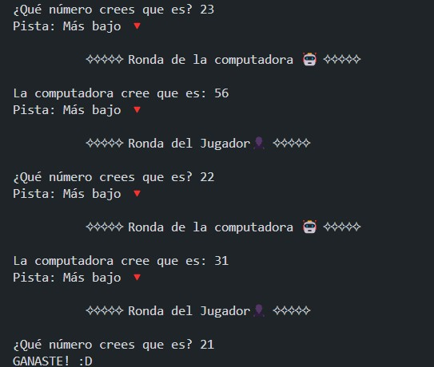

# Adivina el Número

Este es un juego simple en Python donde el jugador y la computadora intentan adivinar un número aleatorio generado por el programa. Es una forma divertida de practicar la lógica y la programación en Python.

  

## Cómo funciona

1. **Generación del Número**: El programa genera un número aleatorio entre 1 y 100.
2. **Turnos del Jugador y la Computadora**:
   - **Turno del Jugador**: El jugador introduce su conjetura. El programa proporciona pistas sobre si el número es más alto o más bajo que la conjetura.
   - **Turno de la Computadora**: La computadora también hace una conjetura, y el jugador recibe pistas similares sobre si la predicción de la computadora es demasiado alta o baja.
3. **Final del Juego**: El juego termina cuando el jugador o la computadora adivinan el número correcto. Se anuncia al ganador en pantalla.

